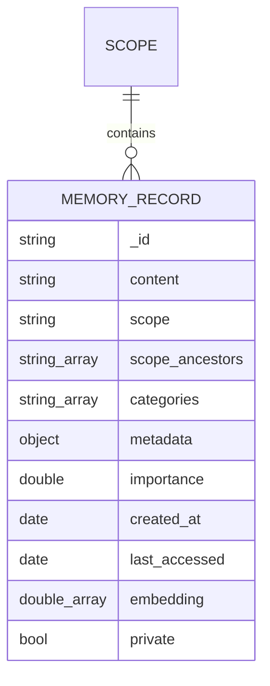

# EDD.md — Entity Document Diagram

The MongoDB data model for `crewai-mongodb-memory`. This is the schema contract agents read before
touching code. Keep it in sync with `src/crewai_mongodb_memory/backend.py` and CrewAI's
`MemoryRecord` (`crewai.memory.types`).

## Entities

### `memories` (database: `crewai_memory`)

One document per CrewAI `MemoryRecord`, keyed by the record's own `id`.

| Field | Type | Required | Description |
|---|---|---|---|
| `_id` | string | yes | Primary key = `MemoryRecord.id` (uuid4 string) |
| `content` | string | yes | The textual memory content |
| `scope` | string | yes | Hierarchical path organizing the memory (e.g. `/crew/team/user`) |
| `scope_ancestors` | string[] | yes | Precomputed ancestor prefixes of `scope`; enables `$vectorSearch` prefix prefilter (vector-search filters don't support `$regex`) |
| `categories` | string[] | no | Tags/categories for the memory |
| `metadata` | object | no | Arbitrary metadata (dotted-path filterable) |
| `importance` | double | no | 0.0–1.0 importance score |
| `created_at` | date | yes | Creation time (newest-first ordering) |
| `last_accessed` | date | yes | Last access time |
| `embedding` | double[1024] | for `search()` | Voyage 3.5 vector for `$vectorSearch` |
| `source` | string \| null | no | Provenance (e.g. user/session id) |
| `private` | bool | no | Visibility flag |

Example document:

```json
{
  "_id": "7c1f…uuid",
  "content": "I'm vegetarian and avoid dairy.",
  "scope": "/users/alex/preferences",
  "scope_ancestors": ["/users", "/users/alex", "/users/alex/preferences"],
  "categories": ["preference"],
  "metadata": { "source": "chat" },
  "importance": 0.5,
  "created_at": "2026-06-07T00:00:00Z",
  "last_accessed": "2026-06-07T00:00:00Z",
  "embedding": [0.01, -0.02, "… 1024 dims …"],
  "source": null,
  "private": false
}
```

### `conversations` (database: `crewai_memory`)

Short-term chat transcript for :class:`ConversationMemory`. **Separate collection** from
`memories` (different lifecycle/access pattern), **no embeddings** (replay is recency/order
based, never semantic), and stored with the MongoDB **bucket pattern**: one document holds
an array of up to `bucket_size` turns; a new bucket rolls over when the current one fills.

| Field | Type | Required | Description |
|---|---|---|---|
| `_id` | ObjectId | yes | Bucket document id (auto) |
| `session_id` | string | yes | Logical conversation id (partitions buckets) |
| `bucket_seq` | int | yes | Monotonic bucket sequence within the session (0-based) |
| `turn_count` | int | yes | Number of turns currently in this bucket (≤ `bucket_size`) |
| `start_turn` | int | yes | Global turn number of the first turn in the bucket |
| `end_turn` | int | yes | Global turn number of the last turn in the bucket |
| `turns` | object[] | yes | Ordered array of turn sub-documents (see below) |
| `created_at` | date | yes | Bucket creation time |
| `updated_at` | date | yes | Last append time |

Each entry in `turns`:

| Field | Type | Description |
|---|---|---|
| `turn` | int | Global, monotonically increasing turn number |
| `role` | string | `"user"` or `"assistant"` |
| `content` | string | The message text |
| `ts` | date | When the turn was appended |

Example bucket document:

```json
{
  "_id": "…ObjectId…",
  "session_id": "alex",
  "bucket_seq": 0,
  "turn_count": 2,
  "start_turn": 1,
  "end_turn": 2,
  "turns": [
    { "turn": 1, "role": "user", "content": "find the current date", "ts": "2026-06-09T00:00:00Z" },
    { "turn": 2, "role": "assistant", "content": "Today is …", "ts": "2026-06-09T00:00:01Z" }
  ],
  "created_at": "2026-06-09T00:00:00Z",
  "updated_at": "2026-06-09T00:00:01Z"
}
```

## Indexes

`memories`:

- `scope_1` — `{ scope: 1 }` — scope-prefix scans, scoped delete/list.
- `categories_1` — `{ categories: 1 }` (multikey) — category filters.
- `created_at_-1` — `{ created_at: -1 }` — newest-first listing + `older_than` deletes.
- Atlas Vector Search `idx_crewai_memory` — over `embedding` (`numDimensions: 1024`,
  similarity `cosine`) with `filter` paths `scope_ancestors` and `categories`.

`conversations`:

- `session_bucket` — `{ session_id: 1, bucket_seq: 1 }` — fetch a session's buckets in
  order (newest-first for recent-turn replay, oldest-first for full transcript). No vector
  index — conversation turns are never embedded.


## Relationships



## Mapping to CrewAI's StorageBackend protocol

| Protocol method | MongoDB operation |
|---|---|
| `save(records)` | `replace_one(upsert=True)` per record |
| `search(query_embedding, scope_prefix, categories, metadata_filter, limit, min_score)` | `$vectorSearch` prefiltered on `scope_ancestors` + `categories` + `metadata.*` |
| `delete(...)` | `delete_many` on ANDed criteria (`record_ids` / `scope_prefix` / `categories` / `older_than` / `metadata`) |
| `update(record)` | `replace_one(upsert=True)` |
| `get_record(id)` | `find_one({_id})` |
| `list_records(scope_prefix, limit, offset)` | `find().sort(created_at desc).skip().limit()` |
| `get_scope_info(scope)` | aggregate count/categories/date-range/children for the scope subtree |
| `list_scopes(parent)` | `distinct("scope")` → immediate children of `parent` |

## Notes

- Seed data: the shared `data/embeddings.json` corpus (17 team-member documents with
  pre-computed 1024-dim `embedding` vectors). Demo reruns **replace** the demo scope.
- `embedding` is `exclude=True` on CrewAI's `MemoryRecord` (dropped by `model_dump`), so the
  backend persists it explicitly in `_to_doc`.
- appName: `devrel-integ-crewai-python`; driver-info: `crewai-mongodb-memory` (both non-overridable).
